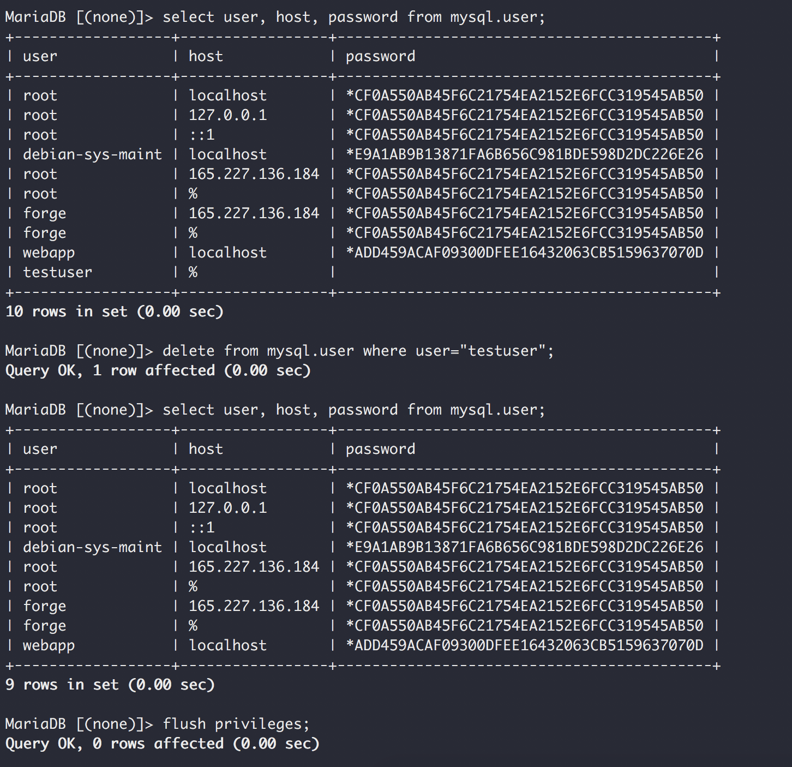
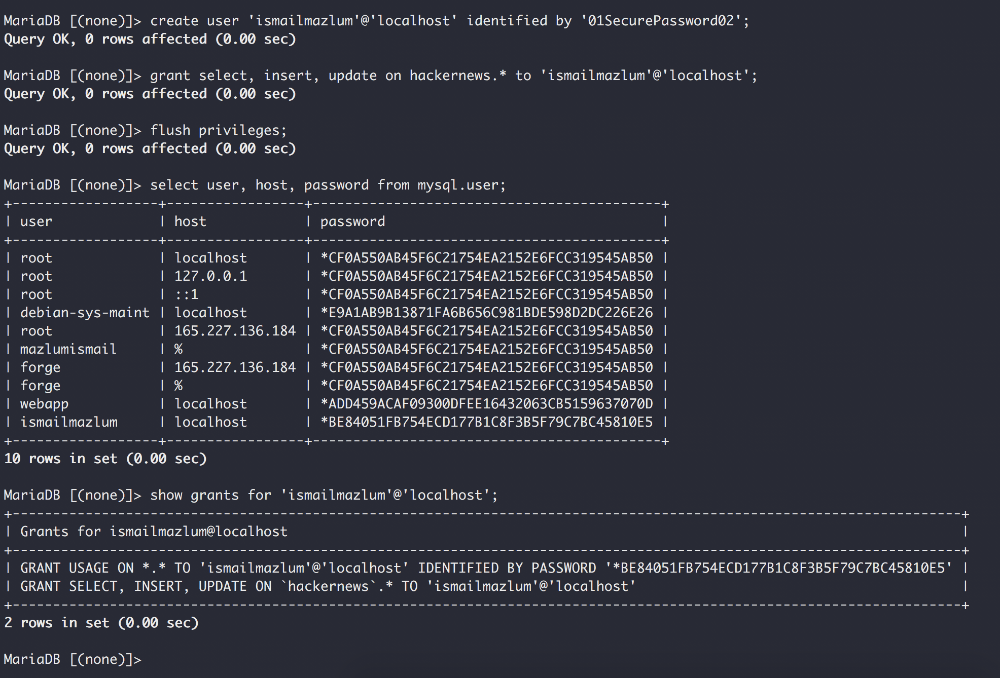

# Sikker MySQL
_af Ismail Cam og Mazlum D. Sert_

Som en af de mest brugte open-source Relational Database Management System er MySQL en god færdighed at have, samt giver fordelagtig karriere muligheder. På grund af det konsekvente niveau af hurtig performance og nemt at bruge er den i dag brugt mange steder, både af webudvikler, individuelle og store organisationer, såsom Youtube, Google og Yahoo. Som de fleste produkter så er sikkerhed ikke en vigtig overvejelse, da man som virksomhed ofte gerne vil have det hurtig op at køre, således at virksomheden kan hurtig drage fordel af det. Det er derfor vigtigt at man sikre MySQL databasen, da det kan have voldsomme konsekvenser, såsom tabt data eller ransomware, som var på omløb i 2017.

### Problemet
Grunden til at vi har valgt og skrive om sikkerhed i MySQL er fordi, at MySQL har været en stor del af vores Hacker News projekt i large Systems Developments fag.
Ansvaret angående MySQL databasen lå i, at opbevare større mængde af pågældende data, hvilket stammer fra en udkommende simulator. Det der har lagt stort opsigt har været, at beskytte MySQL databasen for ondsindede tredjepart, så modtagelsen af dataene fra simulatoren kan ske kontinuert.

For at hindre at dette problem ikke opstår, har vi udfra forskellige blogs udpejede de mest simple og interessante MySQL sikkherheds konfigurationer.

## 7 gode råd til at forbedre MySQL sikkerheden
I denne blog vil vi se på nogle af de mest populære sikkerhedsfaktorer i MySQL, og hermed løsninger til en mere sikker MySQL, dog er det yderst vigtigt, samt antaget at man har sikret serveren, inden man sikre MySQL databasen.

Ofte kan man øge sikkerheden for en MySQL database med små konfigurationer, som kan gøre en stor forskel. Vi vil nedenfor komme eksempler på hvordan man kan øge sikkerheden i en MySQL database.

#### Fjern unødvendige users
Det er vigtig at man ikke har overflødige users, som ikke bliver brugt. Ofte kan det være test users uden specificeret hostname og password, derfor burde disse users straks slettes fra databasen.



Vi har fået inspiration fra følgende blog (http://www.hexatier.com/mysql-database-security-best-practices-2/), og har andvendt denne fremgangsmåde på vores egen database.

---

#### Ændre default user
Alene i 2016 var den mest brugte username “root” og password “123456”, så det er rimeligt at antage dette kan være en realitet. Ofte forsøger hackerne at få adgang til rettighederne til denne bruger, derfor er det vigtigt at denne bruger ændres. Det anbefales at adgangskoden ændres til en kompleks alfanumerisk adgangskode. Dette kan gøres hurtigt og nemt på to step.

```bash
# Change username
mysql> RENAME USER root TO secure_user;

# Change password
mysql> SET PASSWORD FOR 'secure_user'@'hostname' = PASSWORD('01MoreSecurePass02');
```

---

#### Begrænse user tilladelser
Det er vigtigt at man har applikation-specifikke users, altså users som kun har de nødvendige tilladelser til databasen. For at sikre at der ikke kan slettes data via en web-applikation, kan man oprette en user, som f.eks. kun har SELECT, INSERT, UPDATE rettigheder.



Vi har fået inspiration fra følgende blog (http://www.techotopia.com/index.php/MySQL_Users_and_Security), og har andvendt denne fremgangsmåde på vores egen database.

---

#### Skift standard port mappings
MySQL kører som standard på port 3306. Dette bør ændres efter installationen for at forvirre, hvilke tjenester der kører på hvilke porte, da angriberne i første omgang vil forsøge at udnytte standardværdier. Nedenfor viser vi et eksempel på hvordan vi ændre porten fra 3306 til 3360.

```bash
# Open file my.cnf
nano /etc/mysql/my.cnf
```
```bash
# Find the following section, and change the port number
[mysqld]
#
# * Basic Settings
#
#user		= mysql
pid-file	= /var/run/mysqld/mysqld.pid
socket		= /var/run/mysqld/mysqld.sock
port		= 3306
......
```

---

#### Slå "LOAD DATA LOCAL INFILE" kommando fra
Kommandoen "LOAD DATA LOCAL INFILE" gør det muligt for brugere at læse lokale filer og endda få adgang til andre filer på operativsystemet. Dette kan være meget beskadig, hvis det bliver udnyttet af ondsindede bruger ved hjælp af metoder som SQL injection. Det anbefales derfor, at deaktivere kommandoen. Nedenfor viser vi et eksempel på hvordan vi deaktivere kommandoen.

```bash
# Open file my.cnf
nano /etc/mysql/my.cnf
```
```bash
# Find the following section
[mysqld]
#
# * Basic Settings
#
......
```
```bash
# Insert this in end of the section
local-infile=0
```

---

#### Deaktiver fjernadgang til databasen
Skal databasen kun bruges af lokale applikationer, anbefales det at fjernadgang til databasen deaktiveres. Denne konfiguration sikre, at MySQL ikke acceptere forbindelser fra hvor som helst, men kun localhost. Altså ved at bruge denne konfiguration forhindres MySQL i at lytte til TCP/IP forbindelser, så det kun er lokale users der vil have tilladelse til at oprette forbindelse til MySQL databasen. Nedenfor viser vi et eksempel på hvordan vi deaktivere fjernadgang.

```bash
# Find the following section
[mysqld]
#
# * Basic Settings
#
......
```
```bash
# Insert this in end of the section
skip-networking
```

---

#### Læse/skrive rettighederne til my.cnf filen
Det er vigtigt at beskytte my.cnf filen, så andre end admin ikke kan ændre den. Derfor anbefales det at gøre filen skrivebeskyttet. Nedenfor viser vi et eksempel på hvordan vi skrivebeskytter my.cnf filen.

```bash
sudo chmod 0644 /etc/mysql/my.cnf
```

## Konklusion
Der skal ikke være nogen tvivl om, at man skal priotere sikkerheden højt, samt tage højder for en fejlfri opsætning. 
Da database ofte er udsat for angreb, er det vigtigt at man sætter sig ind i de forskellige konfigurationer, for hvordan man beskytter databasen så godt som muligt. 
Det er en god ide at vægte sikkerheden højt, når man skal vælge hvilken database der skal bruges. Det kan ikke blive sagt nok, at enhver udvikler skal have det fundamentale på plads, når der snakkes om sikkerhed. Det kunne f.eks. være hashing af passwords eller andre følsomme data. Vi har gang på gang set, at dårlig sikkerhed kan have livsfarende konsekvenser, og koste virksomheder millioner. 

Er MySQL en del af udviklingen, så er der vise standarder der burde blive overholdt. Nogle af dem kunne være konfigurationer, som vi har gennemgået i denne blog. Vi har dog i denne blog kun rørt på overfladen, hvor meget sikkerhed der burde være, og håber at det kan være motivation, for forskellige individer og organisationer. 

I Hacker News projekt blev disse sikkerheds konfigurationer ikke anvendt til at starte med. Vi blev dog ikke udstat for nogen former for database angreb, det betyder dog ikke at det ikke kunne ske, derfor for at gøre vores MySQL database mere sikker, har vi konfigureret disse sikkerheds konfigurationer.

Man kan undre sig over hvorfor MySQL teamet ikke har disse konfiguration out-of-the-box. En af grundende til, at disse sikkerheds konfigurationer ikke er dækket af MySQL teamet, er netop for at vi som udvikler kan drage nytte af dem, uden at være begrænset.  

## Kilder
- http://www.techotopia.com/index.php/MySQL_Users_and_Security
- http://www.hexatier.com/mysql-database-security-best-practices-2/
- https://www.mysql.com/why-mysql/presentations/mysql-security-best-practices/
- https://www.techrepublic.com/article/the-top-10-worst-ransomware-attacks-of-2017-so-far/
- https://www.percona.com/blog/2017/02/27/mysql-ransomware-open-source-database-security-part-3/
- http://uk.businessinsider.com/most-popular-passwords-incredibly-insecure-easy-to-guess-123456-hacking-2017-1?r=US&IR=T
- https://www.w3resource.com/mysql/mysql-security.php
- https://www.digitalocean.com/community/tutorials/how-to-secure-mysql-and-mariadb-databases-in-a-linux-vps
- https://www.upguard.com/articles/top-11-ways-to-improve-mysql-security
